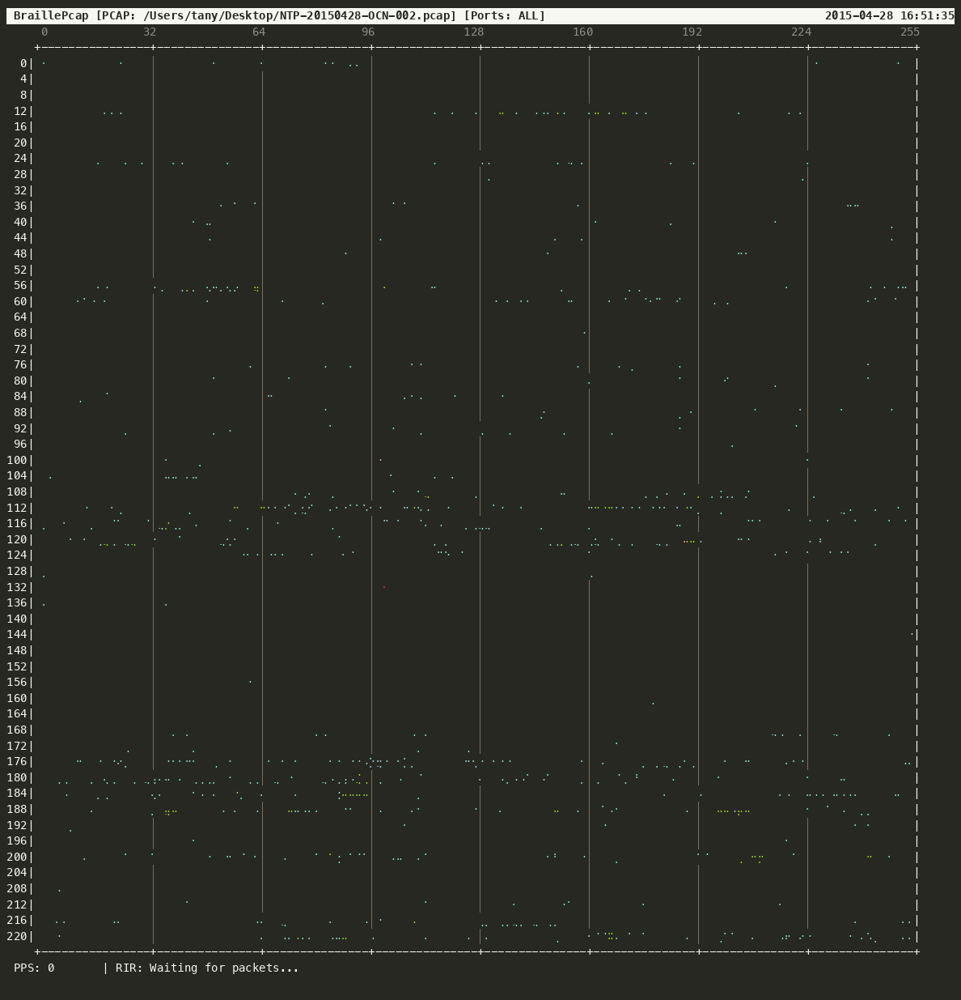

# BraillePcap

Terminal-based IPv4 traffic visualizer in Rust using Unicode Braille characters.



## Features

- Real-time packet capture display on a 224x256 IPv4 grid (Excludes Class D/E multicast & reserved space)
- Support for pcap files and live interfaces
- Regional Internet Registry (RIR) traffic statistics
- `/16` detail view for inspecting traffic in a focused 4x4 block
- Live packet counters and activity updates in both the main and detail views
- Input validation for zoom targets and omitted IPv4 CIDR networks
- Reserved Class D/E and `0.0.0.0/8` networks are rejected for omitted ranges

## Requirements

- **Terminal Size**: Minimum **134 x 63** characters
- **Font**: Terminal font with Unicode Braille Patterns support (`U+2800`–`U+28FF`)

## Supported Platforms

Tested and confirmed working on:

- macOS (Apple Silicon)
- Ubuntu 24.04.4 LTS
- OpenBSD 7.9

## Prerequisites

### Ubuntu / Debian

Build dependencies for the `pcap` library:

```bash
sudo apt update
sudo apt install -y libpcap-dev pkg-config
cargo build --release
```

### OpenBSD

OpenBSD includes libpcap in its base system, but its version string format requires explicit version hints during Rust compilation:

```bash
LIBPCAP_VER=1.10.0 cargo build --release
```

## Options

| Option | Short | Description | Default |
| --- | --- | --- | --- |
| `--interface <INTERFACE>` | `-i` | Network interface for live capture | `en0` |
| `--read-file <FILE>` | `-r` | Read PCAP file or '-' for stdin | - |
| `--speed <SPEED>` | `-s` | Replay speed for PCAP file (0 = max speed) | `1.0` |
| `--hold-time <SECS>` | `-t` | Dot persistence duration in seconds | `0.5` |
| `--port <PORTS...>` | `-p` | Filter by port numbers (e.g., `-p 80 443`) | - |
| `--omit <CIDR...>` | `-o` | Exclude IP networks in CIDR notation | - |
| `--buffer-size <MB>` | `-b` | Capture buffer size in MB for live capture | `8` |
| `--help` | `-h` | Print help information | - |
| `--version` | `-V` | Print version information | - |

## Usage

```bash
# Live capture
sudo cargo run --release -- -i en0

# Read pcap file
cargo run --release -- -r sample.pcap
```

### Detail View

Press `z` or `Z` in the main view to open the `/16` input screen. Enter the first
two IPv4 octets, for example `10.123` or `10.123/16`, and press `Enter`.
The detail view shows the selected `/16` area as a 4x4 grid of neighboring
`/16` networks with approximate per-network PPS values. The overlay is centered
in the terminal and updates while capture continues.

Invalid IPv4 values, unsupported CIDR prefixes, and reserved Class D/E or
`0.0.0.0/8` ranges are rejected with an error. Loopback (`127.0.0.0/8`) and
link-local (`169.254.0.0/16`) ranges remain available for inspection.

## How to Read the Grid

- Vertical Axis (Y): First IPv4 Octet (0 – 223)
- Horizontal Axis (X): Second IPv4 Octet (0 – 255)
- Color Legend (Packet Frequency):
  - 🩵 Cyan: 1 – 5 packets
  - 🟩 Green: 6 – 20 packets
  - 🟨 Yellow (Bold): 21 – 100 packets
  - 🟥 Red (Bold): 101+ packets

## Keybindings

| Key | Action |
| --- | --- |
| `Space` | Pause / Resume visualization |
| `r` | Clear screen & reset packet counters |
| `z` / `Z` | Open the `/16` detail view |
| `Enter` | Open the detail view for the entered address |
| `Esc` | Cancel input or return from the detail view |
| `q` | Quit application |

## Technical Note: Braille Grid & Color Representation

Due to terminal emulator specifications, **each character cell supports only a single foreground color**, whereas one Braille character contains an **8-dot grid (2x4)**.

To balance spatial density with attribute visualization:

- **Dots (Position):** Each of the 8 dots independently indicates whether traffic was seen in its corresponding IPv4 subrange within the current hold window.
- **Color (Intensity):** The color of the character cell represents a **relative activity score** for that 2x4 cell, based on how many packet hits occurred in the current hold window. It is intentionally **not an exact per-/24 PPS measurement** for any individual dot or subnet.

In other words, a red cell means the cell was significantly more active than a cyan cell in the current viewing window, but it does not mean the underlying /24 is generating a precise PPS value. For exact traffic rate information, use the global PPS counter in the status line.

The detail view uses the same recent activity window and displays approximate
per-network PPS values derived from that window. The global PPS and RIR summary
are updated in batches to keep CPU usage low during high-volume captures.

## License

This project is licensed under the MIT License - see the [LICENSE](LICENSE) file for details.
